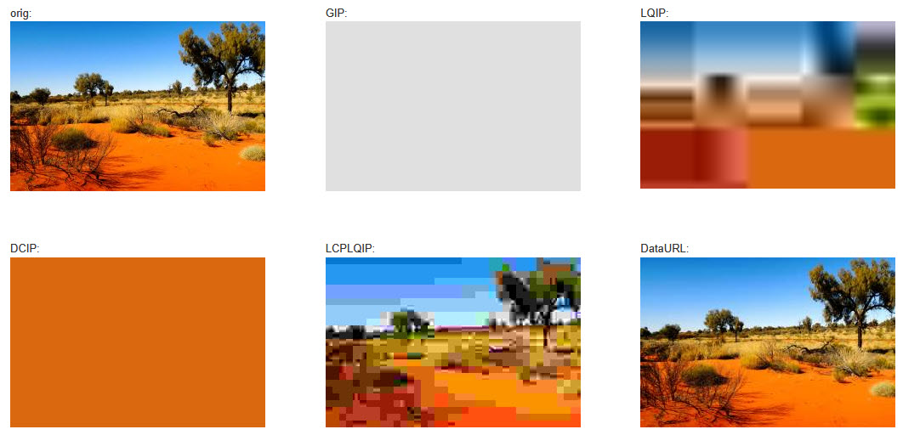

# Silverstripe Image Placeholders

## Overview

This modules provides:
* LQIP (low quality image placeholder)
* GIP (greyscale image placeholder)
* DCIP (dominant color image placeholder)
* DataURL (base64 encoded image data)

It also contains a method for [LCP LQIP described by Harry Roberts](https://csswizardry.com/2023/09/the-ultimate-lqip-lcp-technique/) 
which lets you use a LQIP so that it counts as the LCP image and the hi-res image gets swapped in later on. Thanks Harry 
for this wizardry ;)

## Requirements

* Silverstripe Assets ^3 (Silverstripe ^6)
* ksubileau/color-thief-php ^2

## Installation

Install the module using composer:
```
composer require innoweb/silverstripe-image-placeholders dev-master
```
Then run dev/build.

## Usage

> [!IMPORTANT]
> Make sure that any resizing is done prior to generating the placeholder image.
> 
> Do: ``
> 
> Don't: ``

LQIP, GIP and DCIP are smaller versions of the original image. Always write your own image tags 
with `width` and `height` attributes to make sure the image gets rendered correctly.  

### Lazy loading via Javascript

You can use these placeholders for images that are lazy loaded via Javascript, e.g.:

```

```

And then use [lazysizes](https://github.com/aFarkas/lazysizes) to load the images.

This uses the Base64 encoded data URL of the LQIP as a placeholder and then lazy loads the hi-res image.

### Native lazy loading

You can also use these placeholders for images that are lazy loaded natively:

```

```

This uses the Base64 encoded data URL of the LQIP as a background of the image that is displayed 
while the actual image is loaded.

### Placeholder for LCP image

Harry Roberts describes in a [blog post](https://csswizardry.com/2023/09/the-ultimate-lqip-lcp-technique/) 
how a LQIP can be set so that it counts as the LCP image and the hi-res image gets swapped in later on. 

This module supports this behaviour with the `LCPLQIP` method.

You can set the bits per pixel (BPP) threshold described by 
[Google](https://chromium.googlesource.com/chromium/src/+/refs/heads/main/docs/speed/metrics_changelog/2023_04_lcp.md)
using the following setting:

```
Innoweb\ImagePlaceholders\ImageExtension:
  min_bits_per_pixel: 0.055
```

Per default this is set to 0.055, which gives the value defined by Google another 10% to be on 
the safe side.

To use the LCP LQIP image, preload the LQIP image and set it as background for the actual image:

```
<head>
  ...
  <link rel="preload" as="image" href="$Image.LCPLQIP.URL.ATT" fetchpriority="high">
  ...
</head>
<body>
  ...
  
  ...
</body>

```

This way, the LQIP image is already loaded when the page is rendered and the hi-res image is then 
downloaded and swapped in. (The CSS background colour is used as another fallback, in case the 
LQIP is not available yet.)

Because the `LCPLQIP` image is over the BPP threshold and the hi-res image has the same dimensions 
as the `LCPLQIP` image, the `LCPLQIP` image is counted as the LCP image instead of the hi-res image.

## Examples

Here are some examples of the code and the resulting images:

```html
<p>orig:<br>$Image.Quality(80).Fill(300,200)</p>
<p>GIP:<br></p>
<p>LQIP:<br></p>
<p>DCIP:<br></p>
<p>LCPLQIP:<br>$Image.Fill(300,200).LCPLQIP</p>
<p>DataURL:<br></p>
```



## License

BSD 3-Clause License, see [License](license.md)
